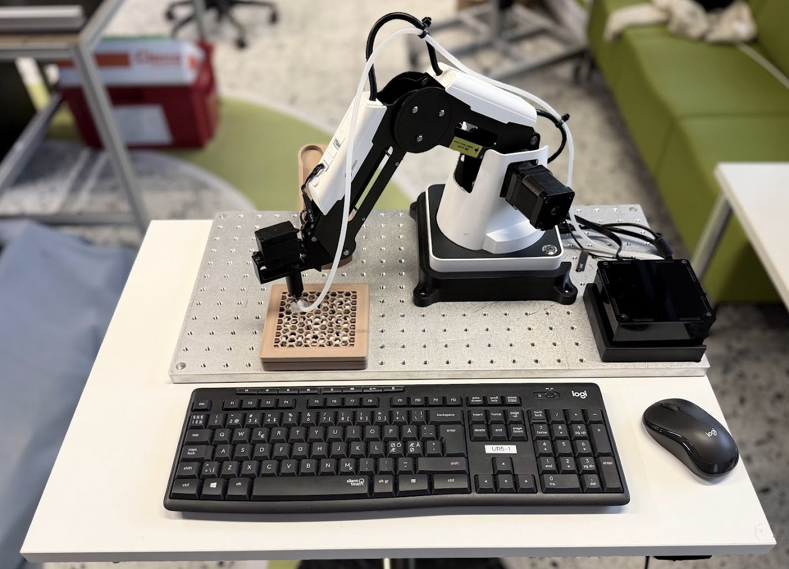

# Robot Tic-Tac-Toe

Small Dobot Magician tic-tac-toe app with a Tk GUI.



## Main programs

- `tictactoe.py`: main GUI game. Supports `PvP`, `PvAI`, and `AivAI`.
- `calibrate_robot.py`: terminal calibration tool. Used to capture `calib_points.json`.

## Project structure

- `tictactoe.py`: GUI, game flow, robot task scheduling, mode switching.
- `helpers/game_logic.py`: tic-tac-toe rules and minimax.
- `helpers/robot_motion.py`: robot motion routines for pick, place, cleanup, and homing.
- `helpers/load_calibration.py`: loads board and feeder calibration from JSON.
- `dobot_python/`: Dobot serial protocol wrapper.
- `calib_points.json`: saved robot positions for pick/place, board corners, and `PRE_HOMING`.
- `assets/`: board and icon images used by the GUI.

## Run

GUI:

```bash
python tictactoe.py
```

Mock mode without hardware:

```bash
python tictactoe.py --mock
```

Calibration tool:

```bash
python calibrate_robot.py
```
